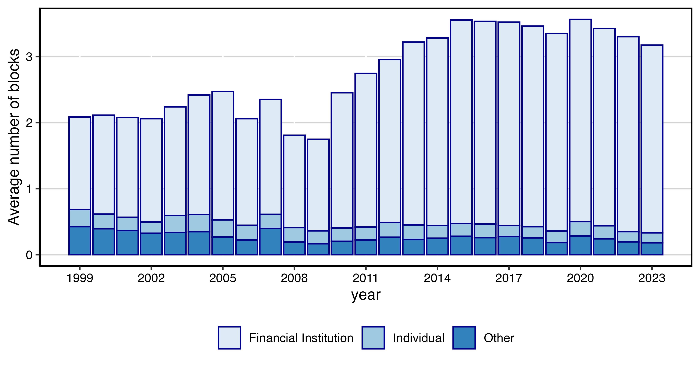

<a href="blockholders.csv" class="download-btn">Click Here to Download the Data</a>

Last updated in May 2024

<a href="https://papers.ssrn.com/sol3/papers.cfm?abstract_id=3621939" class="btn btn-outline-primary" target="_blank">SSRN</a>
<a href="https://wrds-www.wharton.upenn.edu/pages/get-data/contributed-data-forms/blockholders-schwartz-ziv-volkova/" class="btn btn-outline-primary" target="_blank">WRDS</a>
<a href="https://github.com/volkovacodes/Block_Codes" class="btn btn-outline-primary" target="_blank">GitHub</a>
<a href="/research/blockholders/" class="btn btn-outline-primary">Paper</a>

{.featured-image fig-align="center"}

## About the Dataset

The dataset includes all blockholder (holding at least 5% of the firms outstanding shares) in US public companies for each year within the 1998-2023 period. The data provide an annual snapshot (for December of each year). The data on the block positions was extracted from 13D and 13G filings and their amendments. In these filings shareholders disclose their block holdings (i.e., positions that are at least five percent of the firm's outstanding shares).

### Publication

The data is described in the paper ["Is Blockholder Diversity Detrimental?"](/research/blockholders/) by Miriam Schwartz-Ziv and Ekaterina Volkova. This [GitHub](https://github.com/volkovacodes/Block_Codes) page provides the R-scripts used to collect, parse, and assemble the dataset.

### Scope

The data covers all firms listed on SEC EDGAR, including those in CRSP/Compustat. Therefore, if a specific firm-year observation listed in CRSP/Compustat is not found in our publicly available blockholder database, it indicates that the observation does not have any blockholders.

### Access

This dataset is also available through WRDS: [WRDS Data Access](https://wrds-www.wharton.upenn.edu/pages/get-data/contributed-data-forms/blockholders-schwartz-ziv-volkova/)

### Variable Definition

- **blockholder_CIK** – Blockholder CIK code
- **blockholder_name** – Blockholder name
- **company_CIK** – Company CIK code
- **company_name** – Company name
- **year** – Year of filing
- **position** – % of shares held at the end of the calendar year
- **block_type** – Description whether a blockholder is an individual, financial institution or other type of blockholder
- **files_13F** – Indicator whether blockholders files 13F
