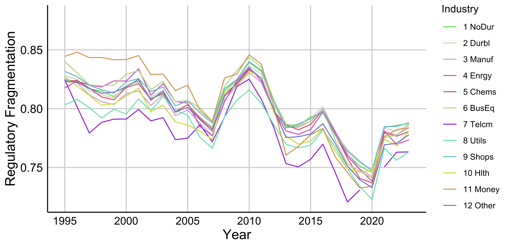

<a href="companyyear_measures.csv" class="download-btn">Click Here to Download the Data</a>

<a href="https://papers.ssrn.com/sol3/papers.cfm?abstract_id=3802888" class="btn btn-outline-primary" target="_blank">SSRN</a>
<a href="https://github.com/volkovacodes/Regulatory_Fragmentation" class="btn btn-outline-primary" target="_blank">GitHub</a>
<a href="/research/fragmentation/" class="btn btn-outline-primary">Paper</a>

{.featured-image fig-align="center"}

## About the Measure

We develop a measure of regulatory fragmentation, which captures the extent to which each individual topic is regulated by multiple federal agencies. Our measure is analogous to the Herfindahl-Hirschman Index (HHI): an issue that is regulated by only one agency is highly concentrated, and thus has the lowest possible fragmentation. We find that the least fragmented topic is "Securities: investment companies," a highly specialized topic that is regulated by only a handful of financial agencies. In contrast, "Government Procurement: Small Businesses" is one of the most fragmented topics, handled by several dozen agencies.

Using machine learning techniques, we identify the set of regulatory topics that are relevant to each firm, and we weight each of these topics by their relative importance to the firm. We find that regulatory fragmentation is a fundamental issue for U.S. companies. The typical firm's business model relates to multiple regulatory topics, and each topic is spread across multiple agencies. In other words, many firms are accountable to numerous regulatory bodies. Interestingly, the firm's regulatory fragmentation is not strongly correlated with other characteristics such as size and total regulatory burden.

## Dataset

The dataset covers all SEC EDGAR companies starting from 1995. The sample provides company names and CIK (identifiers used by the SEC).

The main variable, **Regulatory_Fragmentation**, reflects the variety of agencies a company is exposed to in a given year. Higher values of this variable suggest that a company is regulated by more agencies. We also provide two additional variables:

- **Topic_Dispersion** - Shows the dispersion of topics raised by the company in their annual reports.
- **Regulation_Quantity** - Reflects the amount of the relevant regulations.

### Publication

We describe the construction of this data in more detail in the paper ["Regulatory Fragmentation"](/research/fragmentation/) with Joseph Kalmenovitz and Michelle Lowry.
