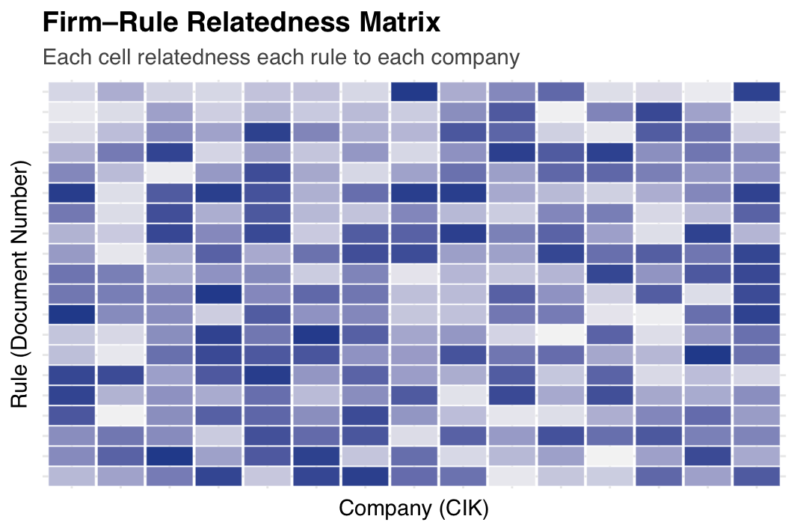

<a href="https://papers.ssrn.com/sol3/papers.cfm?abstract_id=5006884" class="btn btn-outline-primary" target="_blank">SSRN</a>
<a href="/research/lobby/" class="btn btn-outline-primary">Paper</a>

{.featured-image fig-align="center"}

  <a href="https://www.dropbox.com/scl/fi/qo4qpe2zfyg9qyb63ssph/rule_relatedness_data.zip?rlkey=hcpoq2hzh74jiocvqupdpx0g9&dl=0"
     class="download-btn">
    Click Here to Download the Data
  </a>

## About the Measure

This dataset provides company-specific measures of rule relatedness for all proposed and final rules between 1999 and 2023. The measure captures how relevant each regulatory rule is to specific companies.

### Publication

We describe the construction of this data in more detail in the paper ["Lobbying Congress versus Agencies"](/research/lobby/) with Michelle Lowry.
