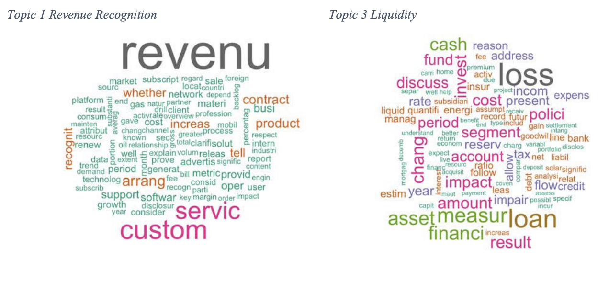
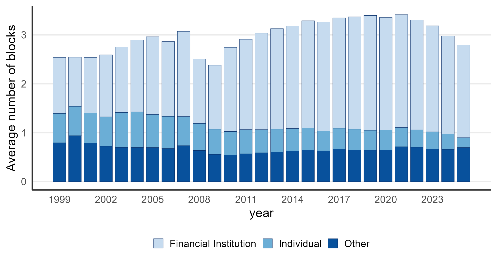

::: {.home-section #about}
::: {.container}

## About me {.section-heading}

::: {.about-grid}

::: {.profile-sidebar}

### Ekaterina Volkova {style="margin-top: 1rem; font-size: 1.5rem;"}

<ul class="social-icons" style="margin-top: 1.5rem;">
<li><a href="https://ssrn.com/author=2535036" target="_blank" title="SSRN"><i class="ai ai-ssrn big-icon"></i></a></li>
<li><a href="https://scholar.google.com/citations?user=XXLvyR4AAAAJ&hl=en" target="_blank" title="Google Scholar"><i class="ai ai-google-scholar big-icon"></i></a></li>
<li><a href="https://twitter.com/Dr_Volkova" target="_blank" title="Twitter"><i class="bi bi-twitter"></i></a></li>
<li><a href="https://github.com/volkovacodes" target="_blank" title="GitHub"><i class="bi bi-github"></i></a></li>
<li><a href="https://www.linkedin.com/in/orhahog/" target="_blank" title="LinkedIn"><i class="bi bi-linkedin"></i></a></li>
<li><a href="uploads/cv_volkova.pdf" title="CV"><i class="ai ai-cv big-icon"></i></a></li>
<li><a href="https://volkovanotes.wordpress.com" target="_blank" title="Blog"><i class="bi bi-wordpress"></i></a></li>
</ul>

:::

::: {.profile-content}

I am an Associate Professor in the Department of Finance at the Faculty of Business and Economics, University of Melbourne.

My research examines corporate governance and the politics of financial regulation, in particular, how large shareholders and regulators (such as the SEC and the Department of Justice) shape corporate policy. I use textual analysis and machine learning to extract quantitative information from corporate disclosures.

I also co-organise the <a href="https://www.acfow.com" target="_blank">Asia-Pacific Corporate Finance Online Workshop</a>, which hosts 2–3 sessions per semester for junior scholars in the region to present their work. <a href="mailto:evolkova@unimelb.edu.au">Email me</a> if you'd like to be added to the mailing list.

:::

:::

::: {.news-section}

#### News {.news-heading}

::: {.news-list}

::: {.news-item}
Jun 2026
[Lobbying Congress versus Agencies](research/lobby/index.qmd), with Michelle Lowry, won the Best Paper Award at the [Lake District Workshop in Corporate Finance](uploads/conferences/2026/lake-district.pdf).
[Regulatory Fragmentation](data/fragmentation/index.qmd) and [Blockholder Ownership](data/blocks/index.qmd) datasets updated through 2025.
:::

::: {.news-item}
Mar 2026
New working paper [Him Too? Analyzing the Effects of Epstein Connections](https://papers.ssrn.com/sol3/papers.cfm?abstract_id=6438562), with Marina Gertsberg and Michaela Pagel.
:::

::: {.news-item}
Feb 2026
Discussed [Antitrust Enforcement Increases Economic Activity](https://papers.ssrn.com/sol3/papers.cfm?abstract_id=4539741) (with Tania Babina, Simcha Barkai, Jessica Jeffers, and Ezra Karger) on <a href="https://open.spotify.com/episode/0f9hAHxxjFwoDeoMdaPXeU?si=roaNEL8FTGu31ZKpdOkHOg" target="_blank">The Brattle Exchange podcast <i class="bi bi-spotify spotify-icon"></i></a>, as part of the FIRN Annual Brattle Prize.
:::

::: {.news-item}
Jan 2026
[Regulatory Fragmentation](https://onlinelibrary.wiley.com/doi/10.1111/jofi.13423) (with Joseph Kalmenovitz and Michelle Lowry) won the [Journal of Finance Brattle Prize (Distinguished Paper)]{.brattle-prize}. Featured on [HKU Jockey Club](https://hkujcesgri.hku.hk/regulatory-fragmentation/) and their <a href="https://open.spotify.com/episode/1FslEOGxXRf7yH6b6kwwIN?si=CCsB3ae6QCuauU5ta8qwRQ" target="_blank">podcast <i class="bi bi-spotify spotify-icon"></i></a>.
:::

:::

:::

::: {.conferences-section}

#### Recent Conferences {.conferences-heading}

::: {.conferences-list}

::: {.conference-year}
2026

<a class="conference-tag" href="uploads/conferences/2026/finance-down-under.pdf" target="_blank">Finance Down Under</a>
<a class="conference-tag" href="uploads/conferences/2026/hku-summer-finance.pdf" target="_blank">4th HKU Summer Finance Conference</a>
<a class="conference-tag" href="uploads/conferences/2026/uebs-edinburgh.pdf" target="_blank">UEBS Edinburgh Corporate Finance</a>
<a class="conference-tag" href="uploads/conferences/2026/lake-district.pdf" target="_blank">Lake District Workshop in Corporate Finance</a>
<a class="conference-tag" href="https://www.fmaconferences.org/Braga/BragaProgram.htm" target="_blank">FMA Europe</a>
<a class="conference-tag" href="uploads/conferences/2026/cicf.pdf" target="_blank">CICF</a>
<a class="conference-tag" href="uploads/conferences/2026/vicif.pdf" target="_blank">VICIF 2026</a>
<a class="conference-tag" href="https://conference.nber.org/altsched/si26cf" target="_blank">NBER SI Corporate Finance</a>
NUS RMI 19th Risk Management
<a class="conference-tag" href="https://efa2026.efa-finance.org" target="_blank">EFA</a>

:::

::: {.conference-year}
2025

<a class="conference-tag" href="uploads/conferences/2025/finance-down-under.pdf" target="_blank">Finance Down Under</a>
<a class="conference-tag" href="uploads/conferences/2025/future-of-financial-information.pdf" target="_blank">7th Future of Financial Information</a>
<a class="conference-tag" href="uploads/conferences/2025/firs.pdf" target="_blank">FIRS</a>
Erasmus Corporate Governance Conference
<a class="conference-tag" href="uploads/conferences/2025/efma.pdf" target="_blank">EFMA</a>
<a class="conference-tag" href="uploads/conferences/2025/global-phd-colloquium.pdf" target="_blank">Global PhD Student Colloquium</a>
<a class="conference-tag" href="uploads/conferences/2025/aarhus.pdf" target="_blank">Third Aarhus Workshop on Strategic Interaction in Corporate Finance</a>
<a class="conference-tag" href="uploads/conferences/2025/efa.pdf" target="_blank">EFA</a>
<a class="conference-tag" href="uploads/conferences/2025/politics-in-finance.pdf" target="_blank">Politics in Finance</a>
<a class="conference-tag" href="uploads/conferences/2025/fma-asia.pdf" target="_blank">FMA Asia</a>

:::

::: {.conference-year}
2024

<a class="conference-tag" href="uploads/conferences/2024/finance-down-under.pdf" target="_blank">Finance Down Under</a>
<a class="conference-tag" href="uploads/conferences/2024/adam-smith-workshop.pdf" target="_blank">Adam Smith Workshop</a>
<a class="conference-tag" href="uploads/conferences/2024/hku-summer-finance.pdf" target="_blank">2nd HKU Summer Finance Conference</a>
<a class="conference-tag" href="https://www.nber.org/conferences/si-2024-law-and-economics" target="_blank">NBER SI Law and Economics</a>
<a class="conference-tag" href="uploads/conferences/2024/firn-women.pdf" target="_blank">FIRN Women</a>
<a class="conference-tag" href="uploads/conferences/2024/efa.pdf" target="_blank">EFA</a>
<a class="conference-tag" href="uploads/conferences/2024/firn-annual.pdf" target="_blank">FIRN Annual</a>
<a class="conference-tag" href="uploads/conferences/2024/sbfc.pdf" target="_blank">Sydney Banking and Financial Stability</a>

:::

:::

:::
:::
:::

::: {.home-section #research style="background-color: #f8f9fa;"}
::: {.container}

## Working Papers {.section-heading}

::: {.stream-item}
::: {.stream-item-content}
### [Him Too? Analyzing the Effects of Epstein Connections](https://papers.ssrn.com/sol3/papers.cfm?abstract_id=6438562)

Marina Gertsberg, Michaela Pagel, <strong>Ekaterina Volkova</strong> · March 2026 

<a href="https://papers.ssrn.com/sol3/papers.cfm?abstract_id=6438562" class="btn btn-outline-primary" target="_blank">SSRN PDF (Free Access)</a>

:::
::: {.stream-item-image}

:::
:::

::: {.stream-item}
::: {.stream-item-content}
### [Lobbying Congress versus Agencies](research/lobby/index.qmd)

Michelle Lowry, <strong>Ekaterina Volkova</strong> · January 2026 

Revise and Resubmit at The Journal of Finance

Presented at HKU Summer Finance Conference, Essex University, Manchester University, Lancaster University, McGill University, University of Illinois Urbana-Champaign, Sydney Banking and Financial Stability Conference

<a href="https://papers.ssrn.com/sol3/papers.cfm?abstract_id=5006884" class="btn btn-outline-primary" target="_blank">SSRN PDF (Free Access)</a>
<a href="data/rule_relatedness/index.qmd" class="btn btn-outline-primary">Data</a>

:::
::: {.stream-item-image}

:::
:::

::: {.stream-item}
::: {.stream-item-content}
### [Antitrust Enforcement Increases Economic Activity](research/antitrust/index.qmd)

Tania Babina, Simcha Barkai, Jessica Jeffers, Ezra Karger, <strong>Ekaterina Volkova</strong> · December 2025

Conditionally Accepted at American Economic Journal, Applied Economics

<em>The Brattle Group FIRN Best Paper Award</em> Presented at EFA, AEA and NBER SI, Boston College, the Center for Equitable Growth, Columbia University, the Department of Justice Antitrust Division, Emory University, the Stigler Center, University of Melbourne, and University of Warwick. <a href="https://www.promarket.org/2023/09/05/antitrust-enforcement-increases-economic-activity/">Summary at Promarket</a>

<a href="https://papers.ssrn.com/sol3/papers.cfm?abstract_id=4539741" class="btn btn-outline-primary" target="_blank">SSRN PDF (Free Access)</a>
<a href="https://www.nber.org/papers/w31597" class="btn btn-outline-primary" target="_blank">NBER WP PDF</a>
<a href="https://www.chicagobooth.edu/-/media/research/stigler/pdfs/workingpapers/332barkaiantitrustbbjkv.pdf" class="btn btn-outline-primary" target="_blank">Stigler Center WP PDF</a>
<a href="research/antitrust/index.qmd" class="btn btn-outline-primary">More information...</a>

:::
::: {.stream-item-image}

:::
:::

## Publications {.section-heading style="margin-top: 3rem;"}

::: {.stream-item}
::: {.stream-item-content}
### [Regulatory Fragmentation](research/fragmentation/index.qmd)

Joseph Kalmenovitz, Michelle Lowry, <strong>Ekaterina Volkova</strong>

Brattle Group Prize (Distinguished paper), The Journal of Finance (2025)

<em>Best paper award at FMARC conference</em> <em>Best paper award at CAFM conference</em>

Presented at AFA, Future of Financial Information Conference, FIRN, APRCF Conference, Copenhagen Business School, the Federal Reserve, George Mason University, University of Rochester, Boston College, University of Toronto, University of Melbourne, University of Washington, Wayne State University, Florida International University, University of Bath, University of Bristol.

<a href="https://doi.org/10.1111/jofi.13423" class="btn btn-outline-primary" target="_blank">DOI</a>
<a href="https://papers.ssrn.com/sol3/papers.cfm?abstract_id=3802888" class="btn btn-outline-primary" target="_blank">SSRN PDF (Free Access)</a>
<a href="data/fragmentation/index.qmd" class="btn btn-outline-primary">Data</a>
<a href="https://github.com/volkovacodes/Regulatory_Fragmentation" class="btn btn-outline-primary" target="_blank">Code</a>
<a href="research/fragmentation/index.qmd" class="btn btn-outline-primary">More information...</a>

:::
::: {.stream-item-image}

:::
:::

::: {.stream-item}
::: {.stream-item-content}
### [Is Blockholder Diversity Detrimental?](research/blockholders/index.qmd)

Miriam Schwartz-Ziv, <strong>Ekaterina Volkova</strong> · February 2025

<strong><em>Management Science</em></strong> (2025)

Presented at the AFA, FMA, FIRN, Frontiers of Finance, QCFC, the Bank of Israel, IE HU Workshop, Ben Gurion University, Binghamton University, Cornell University, Copenhagen Business School, Emory University, the Hebrew University of Jerusalem, Higher School of Economics, University of Hong Kong, London Business School, University of Melbourne, Michigan State University, New Economic School, and the University of Technology Sydney.

<a href="https://doi.org/10.1287/mnsc.2023.00528" class="btn btn-outline-primary" target="_blank">DOI</a>
<a href="https://papers.ssrn.com/sol3/papers.cfm?abstract_id=3621939" class="btn btn-outline-primary" target="_blank">SSRN PDF (Free Access)</a>
<a href="data/blocks/index.qmd" class="btn btn-outline-primary">Data</a>
<a href="https://github.com/volkovacodes/Block_Codes" class="btn btn-outline-primary" target="_blank">GitHub</a>
<a href="research/blockholders/index.qmd" class="btn btn-outline-primary">More information...</a>

:::
::: {.stream-item-image}

:::
:::

::: {.stream-item}
::: {.stream-item-content}
### [Media Ownership and Ideological Slant, Evidence from Australian Newspaper Mergers](research/au_media/index.qmd)

Maxim Ananyev, <strong>Ekaterina Volkova</strong> · December 2024

<strong><em>Plos One</em></strong> (2024)

<a href="https://doi.org/10.1371/journal.pone.0315137" class="btn btn-outline-primary" target="_blank">DOI</a>
<a href="https://papers.ssrn.com/sol3/papers.cfm?abstract_id=5033851" class="btn btn-outline-primary" target="_blank">SSRN PDF (Free Access)</a>

:::
::: {.stream-item-image}

:::
:::

::: {.stream-item}
::: {.stream-item-content}
### [Information Revealed through the Regulatory Process: Interactions between the SEC and Companies ahead of Their IPO](research/sec_letters/index.qmd)

Michelle Lowry, Roni Michaely, <strong>Ekaterina Volkova</strong> · January 2020

<strong><em>The Review of Financial Studies</em></strong> (2020)

<a href="https://doi.org/10.1093/rfs/hhaa007" class="btn btn-outline-primary" target="_blank">DOI</a>
<a href="https://papers.ssrn.com/sol3/papers.cfm?abstract_id=2802599" class="btn btn-outline-primary" target="_blank">SSRN PDF (Free Access)</a>
<a href="https://academic.oup.com/rfs/article/33/12/5510/5716337" class="btn btn-outline-primary" target="_blank">Published Version</a>
<a href="research/sec_letters/sec_appendix.pdf" class="btn btn-outline-primary">Online Appendix</a>

:::
::: {.stream-item-image}

:::
:::

::: {.stream-item}
::: {.stream-item-content}
### [Watch Your Basket - To Determine CEO Compensation](research/ceo/index.qmd)

Neal Galpin, Hae Won (Henny) Jung, Lyndon Moore, <strong>Ekaterina Volkova</strong> · September 2019

<strong><em>Financial Management</em></strong> (2019)

<a href="https://doi.org/10.1111/fima.12243" class="btn btn-outline-primary" target="_blank">DOI</a>
<a href="https://papers.ssrn.com/sol3/papers.cfm?abstract_id=3014572" class="btn btn-outline-primary" target="_blank">SSRN PDF (Free Access)</a>
<a href="https://onlinelibrary.wiley.com/doi/abs/10.1111/fima.12243" class="btn btn-outline-primary" target="_blank">Published Version</a>

:::
:::

::: {.stream-item}
::: {.stream-item-content}
### [Can VPIN Forecast Geopolitical Events? An Application to the Crimean Crisis](research/vpin/index.qmd)

Felipe Silva, <strong>Ekaterina Volkova</strong> · February 2018

<strong><em>Annals of Finance</em></strong> (2018)

News coverage in <a href="https://www.bloomberg.com/view/articles/2015-02-25/russia-s-insider-traders-know-putin-s-plans">Bloomberg</a>, <a href="https://www.washingtonpost.com/news/wonk/wp/2015/03/16/putin-is-back-and-markets-dont-care-what-the-heck-is-going-on/">Washington Post</a>, <a href="https://www.rferl.org/a/stock-trading-russia-crimea-connection-ukraine-american/26873353.html">Radio Liberty</a>, <a href="https://www.derstandard.at/consent/tcf/2000014096695/Krimkrise-Studenten-entdecken-Insiderhandel">Der Standard</a>, <a href="https://www.vedomosti.ru/newspaper/articles/2015/02/24/rinok-znali-o-krime">Vedomosti</a>

<a href="https://doi.org/10.1007/s10436-017-0314-z" class="btn btn-outline-primary" target="_blank">DOI</a>
<a href="https://papers.ssrn.com/sol3/papers.cfm?abstract_id=2828697" class="btn btn-outline-primary" target="_blank">SSRN PDF (Free Access)</a>
<a href="https://link.springer.com/article/10.1007/s10436-017-0314-z" class="btn btn-outline-primary" target="_blank">Published Version</a>

:::
:::

## Review Chapters {.section-heading style="margin-top: 3rem;"}

::: {.stream-item}
::: {.stream-item-content}
### [Initial Public Offering: A Synthesis of the Literature and Directions for Future Research](research/ipo/index.qmd)

Michelle Lowry, Roni Michaely, <strong>Ekaterina Volkova</strong> · November 2017

Review Chapter in <strong><em>Foundation and Trends in Finance</em></strong> (2017)

<a href="http://dx.doi.org/10.1561/0500000050" class="btn btn-outline-primary" target="_blank">DOI</a>
<a href="https://papers.ssrn.com/sol3/papers.cfm?abstract_id=3014572" class="btn btn-outline-primary" target="_blank">SSRN PDF (Free Access)</a>
<a href="https://www.nowpublishers.com/article/Details/FIN-050" class="btn btn-outline-primary" target="_blank">Published Version</a>
<a href="https://github.com/volkovacodes/IPO-Review-Chapter" class="btn btn-outline-primary" target="_blank">GitHub</a>
<a href="research/ipo/ipo_appendix.pdf" class="btn btn-outline-primary">Data Appendix</a>

:::
:::

:::
:::

::: {.home-section #data}
::: {.container}

## Datasets {.section-heading style="text-align: center;"}

::: {.dataset-card data-category="regulations"}
::: {.two-column}
::: {}
{.featured-image}
:::
::: {}
### [Rule Relatedness](data/rule_relatedness/index.qmd)

Company-specific measure of rule relatedness for all proposed and final rules between 1999 and 2023.

<a href="https://papers.ssrn.com/sol3/papers.cfm?abstract_id=5006884" class="btn btn-outline-primary" target="_blank">SSRN</a>
<a href="data/rule_relatedness/index.qmd" class="btn btn-outline-primary">Data</a>
<a href="research/lobby/index.qmd" class="btn btn-outline-primary">Paper</a>

:::
:::
:::

::: {.dataset-card data-category="regulations"}
::: {.two-column}
::: {}
{.featured-image}
:::
::: {}
### [Regulatory Fragmentation](data/fragmentation/index.qmd)

Company-year specific measure of regulatory fragmentation.

<a href="https://papers.ssrn.com/sol3/papers.cfm?abstract_id=3802888" class="btn btn-outline-primary" target="_blank">SSRN</a>
<a href="data/fragmentation/index.qmd" class="btn btn-outline-primary">Data</a>
<a href="research/fragmentation/index.qmd" class="btn btn-outline-primary">Paper</a>
<a href="data/fragmentation/index.qmd" class="btn btn-outline-primary">More information...</a>

:::
:::
:::

::: {.dataset-card data-category="blockholders"}
::: {.two-column}
::: {}
{.featured-image}
:::
::: {}
### [Blockholder Ownership Dataset](data/blocks/index.qmd)

This dataset covers positions of all large shareholders in all US public companies from 1998 until 2023.

<a href="https://papers.ssrn.com/sol3/papers.cfm?abstract_id=3621939" class="btn btn-outline-primary" target="_blank">SSRN</a>
<a href="data/blocks/index.qmd" class="btn btn-outline-primary">Data</a>
<a href="https://wrds-www. wharton.upenn.edu/pages/get-data/contributed-data-forms/blockholders-schwartz-ziv-volkova/" class="btn btn-outline-primary" target="_blank">WRDS</a>
<a href="https://github.com/volkovacodes/Block_Codes" class="btn btn-outline-primary" target="_blank">GitHub</a>
<a href="research/blockholders/index. qmd" class="btn btn-outline-primary">Paper</a>
<a href="data/blocks/index.qmd" class="btn btn-outline-primary">More information...</a>

:::
:::
:::

:::
:::

::: {.home-section #contact style="background-color: #f8f9fa;"}
::: {.container}

## Contact {.section-heading}

::: {.contact-info}

<i class="bi bi-envelope"></i> <a href="mailto:evolkova@unimelb.edu.au">evolkova@unimelb.edu.au</a>

<i class="bi bi-telephone"></i> <a href="tel:+61390355110">+61 3 9035 5110</a>

<i class="bi bi-geo-alt"></i> 198 Berkeley St, Parkville, Melbourne, VIC, Australia, 3053

:::

:::
:::

