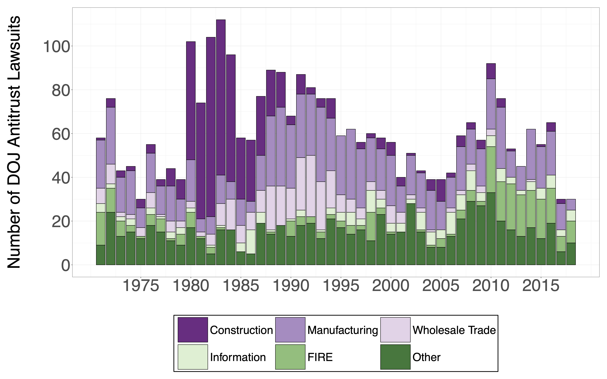

Revise and Resubmit at American Economic Journal, Applied Economics

The Brattle Group FIRN Best Paper Award

<a href="https://papers.ssrn.com/sol3/papers.cfm?abstract_id=4539741" class="btn btn-outline-primary" target="_blank">SSRN PDF (Free Access)</a>
<a href="https://www.nber.org/papers/w31597" class="btn btn-outline-primary" target="_blank">NBER WP PDF</a>
<a href="https://www.chicagobooth.edu/-/media/research/stigler/pdfs/workingpapers/332barkaiantitrustbbjkv.pdf" class="btn btn-outline-primary" target="_blank">Stigler Center WP PDF</a>

{.featured-image fig-align="center"}

### Presentations

*Presented at:*

- EFA, AEA and NBER Summer Institute
- Boston College, Center for Equitable Growth, Columbia University
- Department of Justice Antitrust Division, Emory University
- Entrepreneurship Junior Group Online Seminars
- Labor and Finance Group Conference, NYU WARPFIN Conference
- Stigler Center for the Study of the Economy and the State
- Stigler Center 2023 Antitrust and Competition Conference
- University of Melbourne, University of Warwick

<a href="https://www.promarket.org/2023/09/05/antitrust-enforcement-increases-economic-activity/">Summary at Promarket</a>

## Abstract

This paper examines the effects of antitrust enforcement on local economic activity. Using newly collected data on the operation of the Department of Justice Antitrust Division's local field offices, we document that increased federal antitrust enforcement leads to higher employment, more new businesses, and higher earnings. We find that the effects are driven by smaller and younger firms, and by areas with higher levels of initial concentration. The effects appear in tradable and non-tradable sectors, and are not driven by federal contracts or defense spending. The results suggest that antitrust enforcement plays an important role in promoting local economic activity.

{fig-align="center"}
