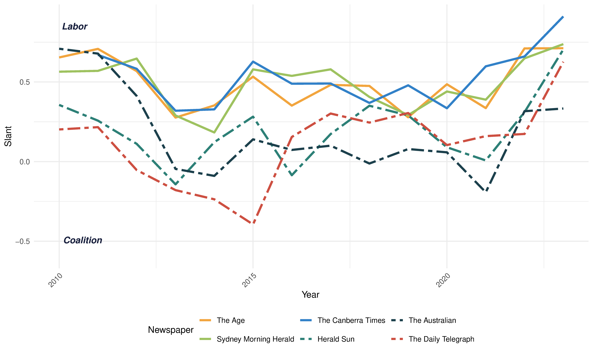

Plos One (2024)

<a href="https://doi.org/10.1371/journal.pone.0315137" class="btn btn-outline-primary" target="_blank">DOI</a>
<a href="https://papers.ssrn.com/sol3/papers.cfm?abstract_id=5033851" class="btn btn-outline-primary" target="_blank">SSRN PDF (Free Access)</a>

{.featured-image fig-align="center"}

## Abstract

This paper examines how changes in media ownership affect the ideological slant of newspapers. Using Australian newspaper mergers as natural experiments, we document how consolidation of media ownership influences news content and political discourse.
