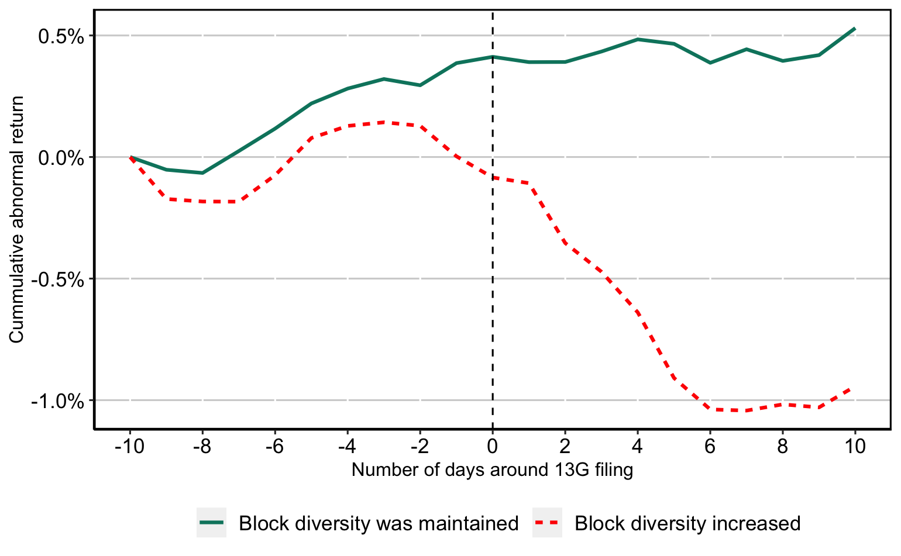

Management Science, Forthcoming

<a href="/data/blocks" style="text-decoration: underline;font-size:20px;">We make the data collected for this project publicly available. Check this page!</a>

<a href="https://doi.org/10.1287/mnsc.2023.00528" class="btn btn-outline-primary" target="_blank">DOI</a>
<a href="https://papers.ssrn.com/sol3/papers.cfm?abstract_id=3621939" class="btn btn-outline-primary" target="_blank">SSRN PDF (Free Access)</a>
<a href="/data/blocks" class="btn btn-outline-primary">Data</a>
<a href="https://github.com/volkovacodes/Block_Codes" class="btn btn-outline-primary" target="_blank">GitHub</a>

{.featured-image fig-align="center"}

### Presentations

*Presented at:*

- AFA, FMA, FIRN, Frontiers of Finance, QCFC
- Bank of Israel, IE HU Workshop
- Ben Gurion University, Binghamton University, Cornell University
- Copenhagen Business School, Emory University
- Hebrew University of Jerusalem, Higher School of Economics
- University of Hong Kong, London Business School
- University of Melbourne, Michigan State University
- New Economic School, University of Technology Sydney

## Abstract

We find that blockholder diversity, i.e., the firm shareholder base including several different types of blocks, is detrimental to firm performance. We show that lagged disclosure, on exogenous predetermined dates, that reveals an increase in block diversity is followed by a negative market reaction. Firms held by heterogeneous blockholders consistently perform worse than firms held by homogeneous blockholders. Block diversity is particularly detrimental when uncertainty is high. Disagreement among shareholders (e.g., as reflected in the frequency of lawsuits being filed) increases when the blockholder base is diverse. We make our blockholder dataset public for the benefit of other researchers.

<strong>Metaphorical Summary:</strong> The image below is an illustration from a famous fable penned by the Russian poet Ivan Krylov, "The Swan, the Crayfish, and the Pike." In this allegorical tale, three animals attempt to pull a wagon together. However, due to their distinct methods and conflicting directions - the swan flying upward, the crayfish crawling backward, and the pike diving into the water - they fail to move the wagon. This lack of coordination and cooperation exemplifies how a failure to align on common goals can lead to complete stagnation.
  
Similarly, in our paper, we explore the dynamics between large shareholders, or blockholders, of different types. Though these shareholders may aim to work in concert, diverging incentives and preferences often render their attempts counterproductive. This modern application of Krylov's timeless message underscores the critical importance of cohesion and aligned interests in the world of corporate finance.

{fig-align="center" width="574"}
