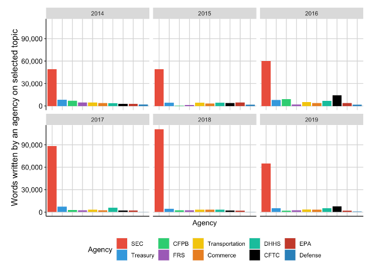

The Journal of Finance (2025)

Best paper award at FMARC conference

Best paper award at CAFM conference

<a href="https://doi.org/10.1111/jofi.13423" class="btn btn-outline-primary" target="_blank">DOI</a>
<a href="https://papers.ssrn.com/sol3/papers.cfm?abstract_id=3802888" class="btn btn-outline-primary" target="_blank">SSRN PDF (Free Access)</a>
<a href="/data/fragmentation" class="btn btn-outline-primary">Data</a>
<a href="https://github.com/volkovacodes/Regulatory_Fragmentation" class="btn btn-outline-primary" target="_blank">Code</a>

{.featured-image fig-align="center"}

Presented at AFA, Future of Financial Information Conference, Financial Research Network (FIRN), APRCF Conference, Copenhagen Business School, the Federal Reserve, George Mason University, University of Rochester, Boston College, University of Toronto, University of Melbourne, University of Washington, Wayne State University, Florida International University, University of Bath, University of Bristol.

## Abstract

We document that companies face a highly fragmented regulatory environment, where multiple agencies regulate overlapping aspects of their operations. We develop a novel measure of regulatory fragmentation that captures the extent to which a firm's activities are regulated by multiple agencies. Firms with higher fragmentation have lower valuations and invest less. Using regulatory reforms that consolidated oversight responsibilities as a natural experiment, we show that reductions in fragmentation lead to increases in firm value and investment. The effects are stronger for firms with higher ex-ante fragmentation. Our results highlight the costs of regulatory complexity and the benefits of regulatory coordination.
