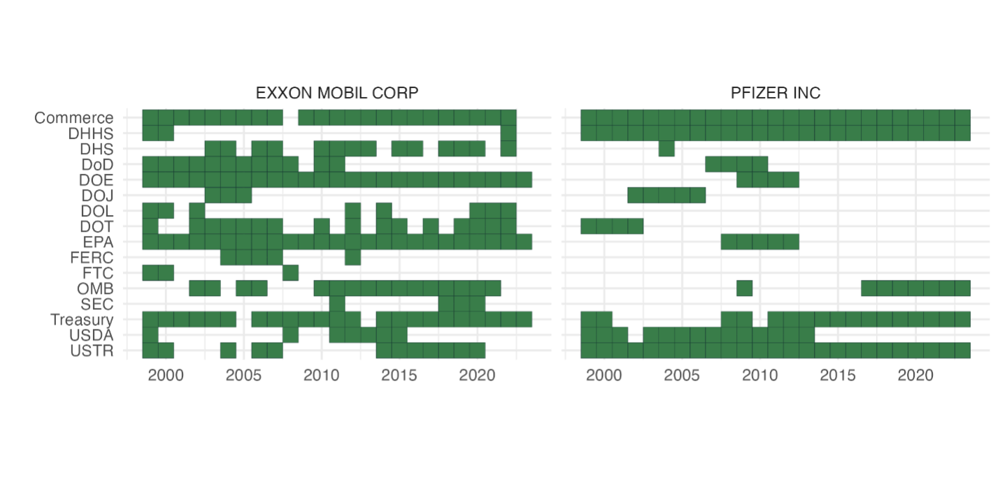

<a href="https://papers.ssrn.com/sol3/papers.cfm?abstract_id=5006884" class="btn btn-outline-primary" target="_blank">SSRN PDF (Free Access)</a>
<a href="/data/rule_relatedness" class="btn btn-outline-primary">Data</a>

{.featured-image fig-align="center"}

Presented at HKU Summer Finance Conference, Essex University, Manchester University, Lancaster University, McGill University, University of Illinois Urbana-Champaign, Sydney Banking and Financial Stability Conference, Politics and Finance Conference (Georgetown)

## Abstract

This paper examines how corporations engage with bureaucrats during the rulemaking process. We document patterns of corporate lobbying and their effects on regulatory outcomes.
