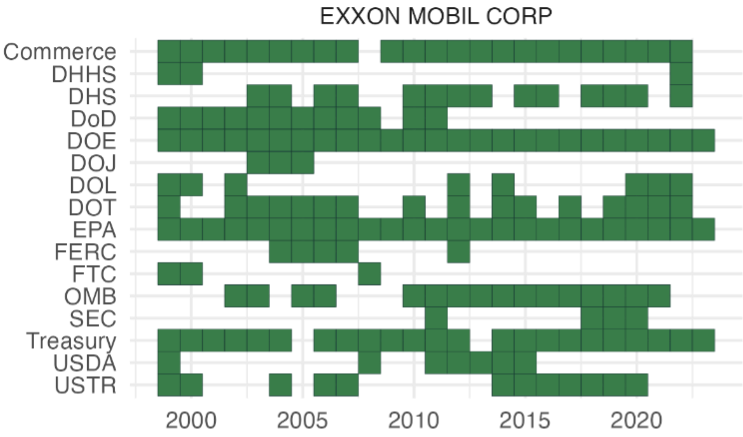

<a href="https://papers.ssrn.com/sol3/papers.cfm?abstract_id=5006884" class="btn btn-outline-primary" target="_blank">SSRN PDF (Free Access)</a>
<a href="/data/rule_relatedness" class="btn btn-outline-primary">Data</a>

{.featured-image fig-align="center"}

Best Paper Award, Lake District Workshop in Corporate Finance 2026. 
Presented at AFA 2027 (expected), EFA, CICF, Lake District Workshop in Corporate Finance, FIRS, EFMA, Future of Financial Information Conference, Aarhus Workshop on Strategic Interaction in Corporate Finance, Politics in Finance Conference (Georgetown), HKU Summer Finance Conference, Sydney Banking and Financial Stability Conference, Essex University, Manchester University, Lancaster University, McGill University, and University of Illinois Urbana-Champaign.

## Abstract

This paper examines how corporations engage with bureaucrats during the rulemaking process. We document patterns of corporate lobbying and their effects on regulatory outcomes.
